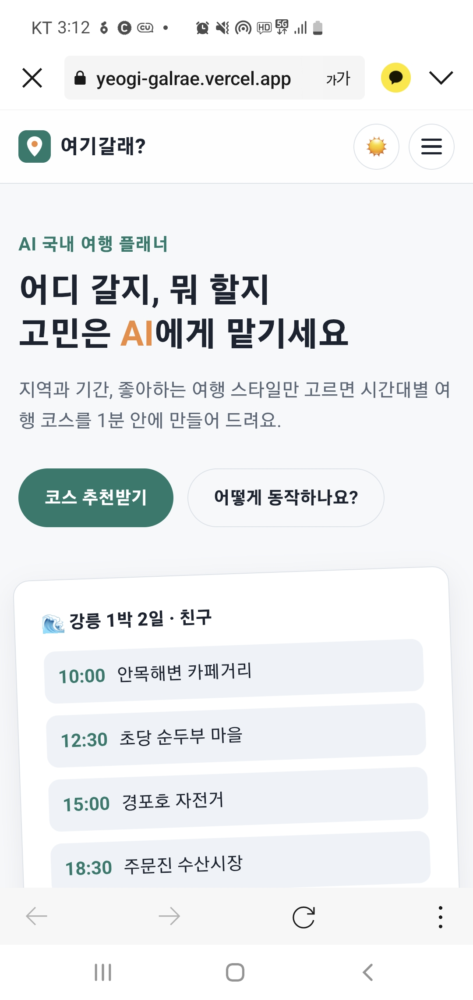
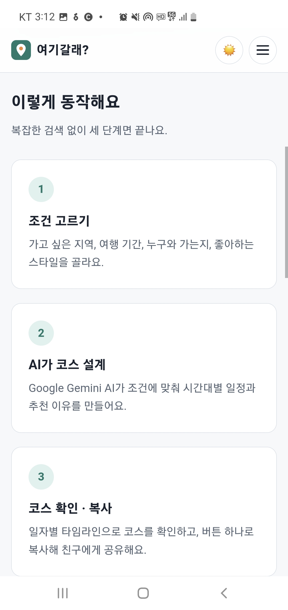
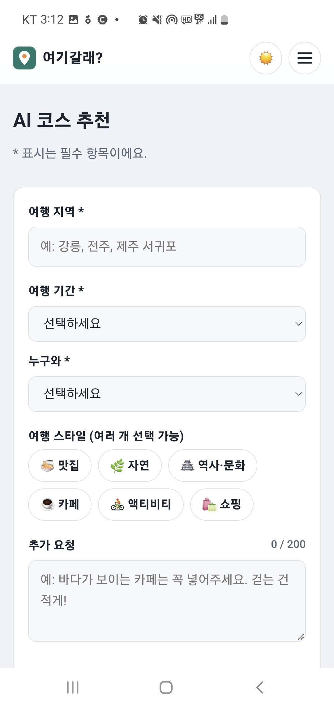
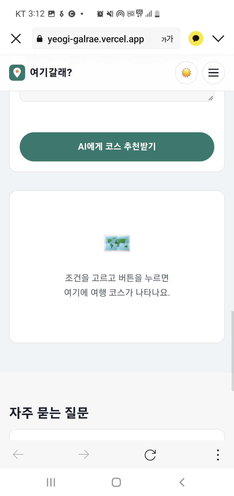
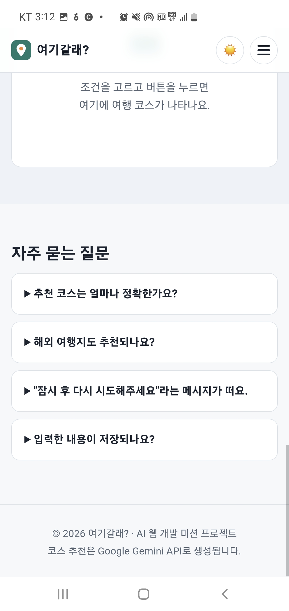
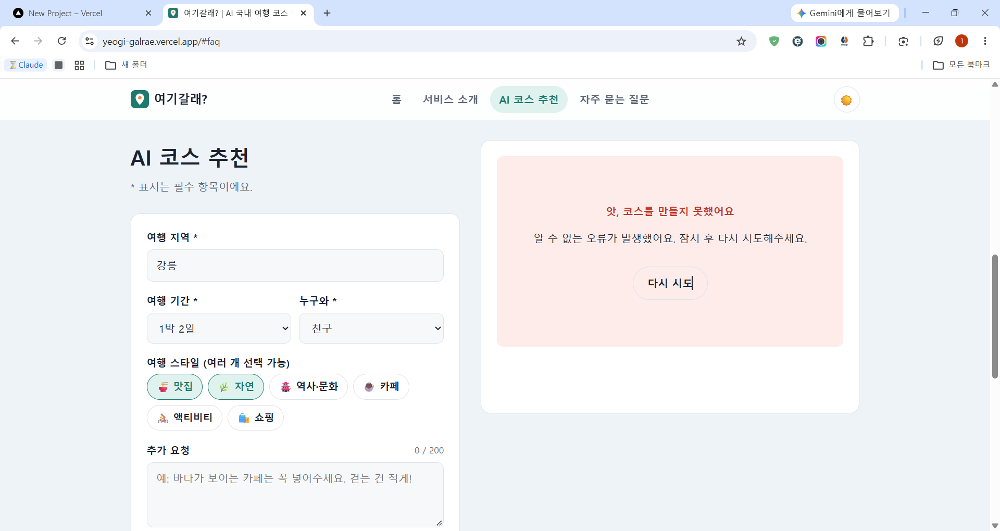

# 📸 증빙 스크린샷

배포 URL(https://yeogi-galrae.vercel.app)에서 직접 캡처한 화면입니다. API 키가 보이는 화면은 포함하지 않았습니다.

## 1. 데스크톱 화면 (PC 브라우저)

### 홈 (Hero)

### 서비스 소개

### 자주 묻는 질문

## 2. 모바일 화면 (실제 휴대폰에서 접속)

화면 폭이 좁아지면 메뉴가 햄버거 버튼(☰)으로 바뀌고, 카드와 입력칸이 한 줄에 하나씩 쌓이도록 반응형으로 배치됩니다.

| 홈 | 서비스 소개 | AI 코스 추천 입력 폼 |
|---|---|---|
|  |  |  |

| 추천 버튼 · 결과 영역 | 자주 묻는 질문 · 푸터 |
|---|---|
|  |  |

## 3. AI 기능 동작 장면

### 정상 입력 → 코스 결과 표시
입력: 창원 / 1박 2일 / 연인 / 맛집·자연 / 추가 요청 "바다가 보이는"

### 실패 처리: API 오류 안내 + 다시 시도 버튼
배포 직후 첫 테스트에서 실제로 발생한 오류 화면입니다. 서버 오류가 나도 화면이 멈추지 않고, 사용자에게 안내 문구와 **다시 시도** 버튼을 보여줍니다.
(원인 분석과 해결 과정은 [03_배포_보안_및_트러블슈팅.md](../03_배포_보안_및_트러블슈팅.md)에 기록)

## 4. 보너스: 다크 모드

오른쪽 위 ☀️ 버튼을 누르면 어두운 테마로 바뀌고 버튼이 🌙로 바뀝니다. 선택한 테마는 브라우저에 저장되어 새로고침해도 유지되며, 처음 방문할 때는 운영체제의 다크 모드 설정을 자동으로 따라갑니다.

### 홈

### 서비스 소개

### AI 코스 추천 입력 폼

### 자주 묻는 질문

